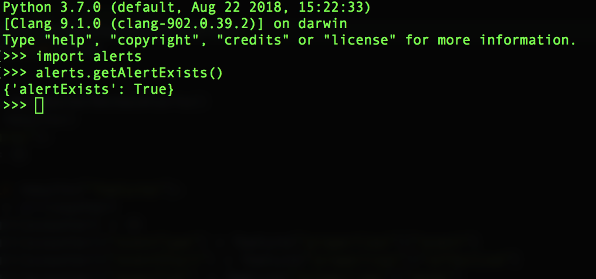
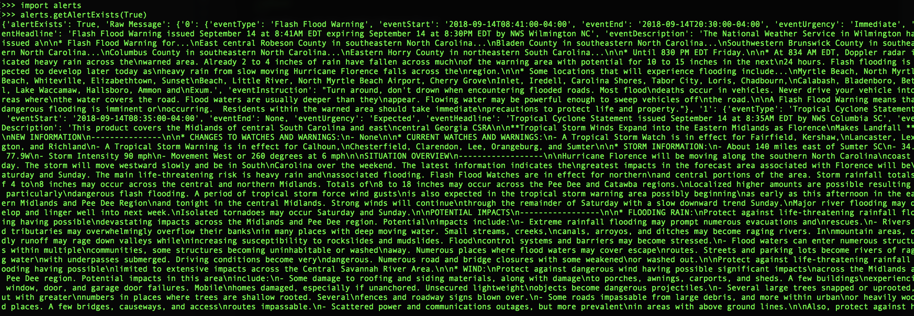

# W.A.B.O
Weather Alert Based Orchestration


WABO is a tool designed to be a starting point for creating complex orchestrations
that are based on weather alerts. I started this project as a POC for my home lab.
The idea was to move my workload to the cloud when there are hurricane alerts in my area.

As time goes on I will add some orchestration examples and some location self awareness logic.


<p align="center">
  
</p>

## Requirements:
* python 3.x
* requests
* urllib
* json

## How do I use it:
First, download `wabo`:

```sh
$ git clone https://github.com/ablinkinz/wabo.git
```
cd to the `wabo` directory:

```sh
$ cd wabo
```

open the python3 repl:
```sh
$ python3
```

import wabos alert module
```python
>>> import alerts
```

let's check to see if we have any current alerts in our area, in verbose mode
(make sure your .config/settings.json file is update for your state and zip)
```python
>>> alerts.getAlertExists(True)
```
<p align="center">
  
</p>

[ablinkin]:                         ./img/ablinkin.png

## Who Uses WABO:
Just me I suppose
